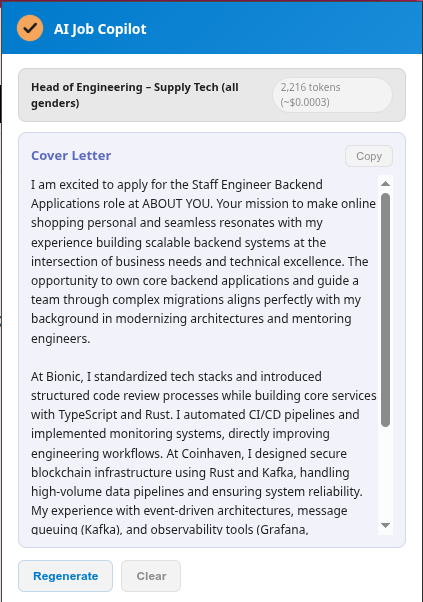
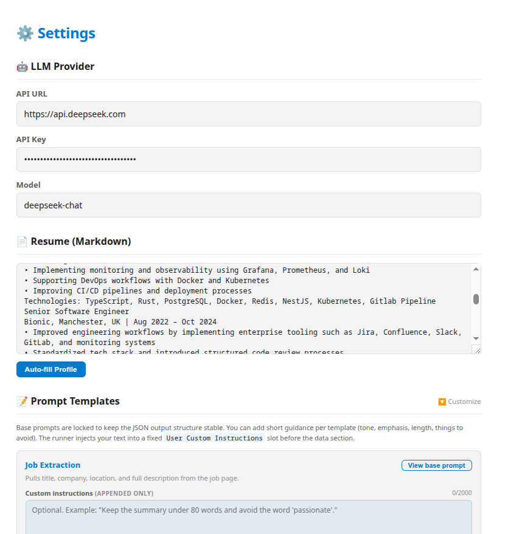
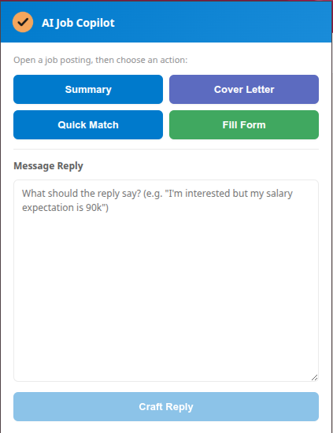
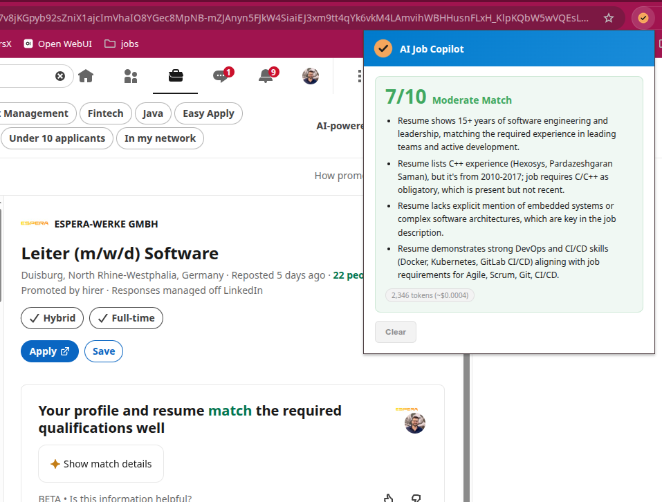
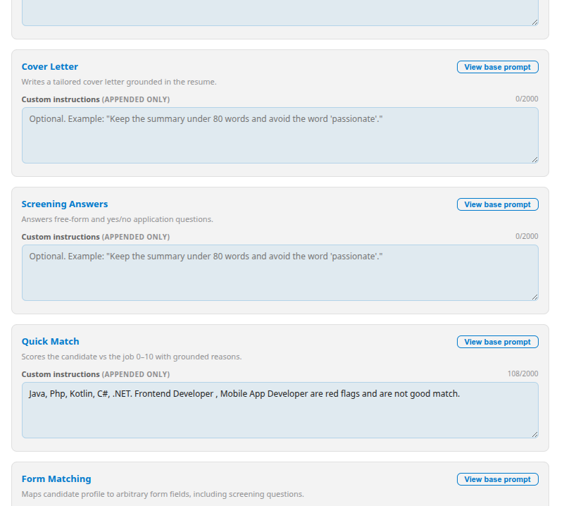
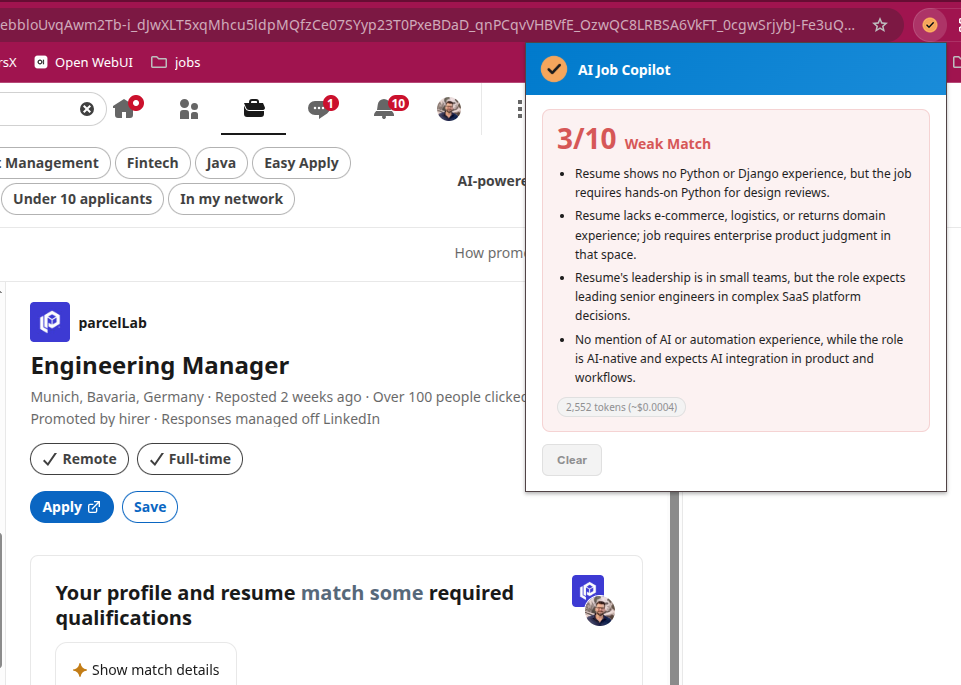

# AI Job Copilot

[](https://github.com/pouladzade/job-hunter-agent/actions/workflows/ci.yml)
[](https://github.com/pouladzade/job-hunter-agent/releases)
[](https://www.typescriptlang.org/)
[](https://developer.chrome.com/docs/extensions/mv3/intro/)
[](LICENSE)
<br>
[](https://codecov.io/gh/pouladzade/job-hunter-agent)
[](https://github.com/pouladzade/job-hunter-agent/pulls)

A browser extension that scrapes any job posting, tailors your application with AI, fills web forms, and crafts message replies — all without ever submitting anything automatically.

**No backend. No database. No Docker.** Everything runs in your browser. Your API key, resume, and profile stay in Chrome's local storage.

## Screenshots

| Cover Letter | Options |
|-------|---------|
|  |  |

| Scrape & Tailor | Quick Match | Custom Prompt | Message Reply |
|-----------------|-------------|-----------|---------------|
|  |  |  |  |

| Quick Match |
|-------------|
|  |

## What it does

- **🔍 Scrape & Tailor** — extract job details from any job board (Greenhouse, LinkedIn, Lever, Ashby, Personio, company career pages, etc.) and generate a tailored application
- **⚡ Quick Match** — evaluate whether a job fits your profile before spending tokens on a full generation
- **✍️ Fill Form** — scrape form fields from any web form, match them to your profile via AI, and inject the values with one click
- **💬 Message Reply** — craft articulate LinkedIn message replies based on your intent and resume
- **📋 Copy to clipboard** on every piece of generated content
- **🔎 LinkedIn Search Builder** — build LinkedIn job search URLs from a structured form instead of hand-typing Boolean queries. Fill in job titles, skills, location/cities, time window, workplace type, experience level, job type, and Easy Apply — then open the search in a new tab with one click
- **💾 Saved Presets** — name and save multiple search configs (e.g. "Backend Remote Germany") for quick reuse. Presets sync across the options page and popup shortcut
- **⚙️ Options page** — configure LLM provider, API key, model, resume, profile fields, all 6 prompt templates, and the LinkedIn Search form

## Quick Start

1. Clone and build:
```bash
pnpm install
pnpm build
```

2. Load in Chrome:
   - Go to `chrome://extensions`
   - Enable "Developer mode"
   - Click "Load unpacked" → select `dist`

3. Configure:
   - Right-click the extension icon → **Options**
   - Set your LLM provider (DeepSeek, OpenAI, Ollama, or any OpenAI-compatible API)
   - Paste your resume and profile info
   - Click **💾 Save All Settings**

4. Use:
   - Navigate to any job posting
   - Click the extension icon
   - Choose **🔍 Scrape & Tailor**, **⚡ Quick Match**, or **💬 Message Reply**

## Supported LLM Providers

| Provider | API URL | API Key Required |
|----------|---------|-----------------|
| DeepSeek | `https://api.deepseek.com/v1` | Yes (`sk-...`) |
| Ollama (local) | `http://localhost:11434/v1` | No |
| OpenAI | `https://api.openai.com/v1` | Yes (`sk-...`) |
| Groq | `https://api.groq.com/openai/v1` | Yes |
| Any OpenAI-compatible | Custom | Depends |

Local providers (localhost/127.0.0.1) automatically skip API key checks and `response_format`.

## Settings

All configurable via the **Options** page (right-click extension → Options, or `chrome://extensions` → AI Job Copilot → Extension options):

| Section | Fields |
|---------|--------|
| 🤖 LLM Provider | API URL, API Key, Model |
| 📄 Resume | Your full resume in Markdown |
| 📝 Prompt Templates | 6 editable prompts (Extract, Tailor, Cover Letter, Screening, Quick Match, Form Match) |
| 👤 Profile Fields | 21 fields (name, email, phone, LinkedIn, GitHub, work authorization, salary, education, etc.) |
| 📥 Quick Import | Paste a JSON profile to fill all fields at once |
| 🔎 LinkedIn Search Builder | Job titles, included/excluded skills, location, cities (comma-separated), time posted, workplace type, experience level, job type, Easy Apply, sort by |

## Permissions

- **`<all_urls>`** — content script injection on any site
- **`storage`** — save settings and application drafts
- **`scripting`** — inject content script on demand
- **`activeTab`** — access the current tab

## Architecture

```
Popup (Preact) ←→ Background Service Worker ←→ LLM API (DeepSeek/Ollama/OpenAI)
       ↕                                              ↕
Content Script — injects into web pages, scrapes text & forms
```

- **Popup:** Main UI (scrape, quick match, reply, fill form, copy)
- **Background Service Worker:** All LLM API calls, message relay, prompt management
- **Content Script:** Page text extraction, form scraping, form filling via DOM events
- **Options Page:** Full settings UI, opens in a dedicated tab
- **Storage:** `chrome.storage.local` — no external database needed

## Tech Stack

- TypeScript (strict mode)
- Preact (popup & options UI)
- Vite (build)
- Jest + jsdom (tests — 26 integration tests)
- Manifest V3 (Chrome extension)
- pnpm

## License

Private — not licensed for redistribution.
